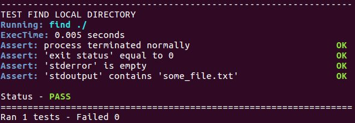

#**Bash Test Tools**
**for testing executables in a shell environment - here's a quick look...**

```bash
# A simple test for the "find" executable
source bash_test_tools

WORK="/tmp/work"

function setup
{
  mkdir -p "$WORK"
  cd "$WORK"
  touch some_file.txt
}

function teardown
{
  cd
  rm -rf "$WORK"
}

function test_find_local_directory
{
  # Run
  run "find ./"
  # Assert
  assert_success
  assert_output_contains "some_file.txt"
}

testrunner
```



# Introduction

Bash Test Tools is intended to be a simple to use framework for testing executables inside
a shell environment. The framework allows extraction and assert operations on parameters
such as **standard output**, **standard error**, **exit code**, **execution time**, **file system** and **network services**.

The Bash Test Tools are suitable for performing high level tests on executables, i.e. **system tests**, treating an executable as
a black box, examining only the output and state of the executable and its environment. Typical domains of use could be to:

* verify complete **use cases**
* identify simple but critical failures, aka **smoke testing**
* verify that documented behavior and **--help** is correct
* collect **performance metrics**  such as **execution time**

In this document we will collectively call these test scenarios **system tests**.

# Workflow
The workflow for implementing tests is as follows,

1. create a bash script
2. source the `bash_test_tools` file
3. define a function called `setup`
4. define a function called `teardown`
5. implement a series of test function, all must be named beginning with `test_` (e.g. `test_foo`).
     * **must** contain a run call, e.g. `run "foo --some-opts args"`
     * followed by at least one assert call, e.g. `assert_success`
6. execute the `testrunner` function (it will magically run all test that have been defined)

When the script is executed each test will be preceeded by a `setup` followed by a `teardown` call.
This is sometimes inefficient but ensures that all tests run in isolation from each other.
If any one assert statement within a test function fails, the whole test will fail.

# Creating a Script
For demonstration purposes we are going to create a test for the UNIX command line tool
**find**, a tool that helps you list and search for files and directories.
First we must fetch the source code and source the `bash_test_tools` file that is located in the root of the
source code directory

```bash
$ # get the source code
$ git clone https://github.com/videntifier/bash_test_tools.github
$ cd bash_test_tools
$ # start editing a new test in you favorite editor (here we use nano)
$ nano test_find.sh
```

At the top of your test script add your typical **shebang** and
source the `bash_test_tools` file.

```bash
#! /usr/bin/env bash
# -*- coding: utf-8 -*-
source bash_test_tools
```

Before implementing our tests we must first define the `setup` and `teardown`
functions that take care of setting up and removing an environment for
the tests.

Typically a `setup` function will create a working directory and `cd`
into it.  The `setup` may also start necessary services and/or provide test files to
operate on. Here is an example setup function that creates a work directory and
adds an empty test file:

```bash
function setup
{
  mkdir -p work
  cd work
  touch some_file.txt
}
```

The teardown function simply cleans up after the test has been performed and
typically may look as follows:

```bash
function teardown
{
  cd ..
  rm -rf work
}
```

We can now define our first test. In this example lets find files in
the local directory, then assert that the operation was successfull and
exited gracefully. Off course we also assert that **find** has discovered
our test file as expected,

```bash
function test_find_local_directory
{
  # Run
  run "find ./"
  # Assert
  assert_success
  assert_output_contains "some_file.txt"
}
```

Finally it is necessary to execute the `testrunner`, without it no tests will be processed.
Add the following line at the bottom of the script,

```bash
testrunner
```

The entire script now looks as follows,

```bash
#! /usr/bin/env bash
# -*- coding: utf-8 -*-
source bash_test_tools

function setup
{
  mkdir -p work
  cd work
  touch some_file.txt
}

function teardown
{
  cd ..
  rm -rf work
}

function test_find_local_directory
{
  # Run
  run "find ./"
  # Assert
  assert_success
  assert_output_contains "some_file.txt"
}

testrunner
```
Execute the script
```bash
chmod u+x test_find.sh
./test_find.sh
```

and the output should look as follows,


## Review
Lets look in a little more detail what our test did.
The test defined did three things:

* First the `"find ./"` execution call was passed to the `bash_test_tools` `run` function. Note the quotes `"find ./"`, they are necessary.
`Run` will collect various metrics into global shell variables called `output`, `error`, `exectime`, `returnval` and `strace` - these will be addressed in detail later.
* The second function call `assert_success` is a generic assert for healthy program termination with success. In fact the single `assert_success` call consists of a series of more granular asserts, called `assert_terminated_normally`, `assert_exit_success` and `assert_no_error`.
    * `terminated normally` checks if executable exited normally (i.e. **without crashing** signals such as SIGENV).
    * `exit success` checks the exit status is 0 (SUCCESS).
    * `no error` will verify that nothing has been printed to standard error.
* The third function call `assert_output_contains` simply verifies that the `find` has correctly reported to `standard output` that the test file `some_file.txt` was found.


# Script Options
The framework automatically embeds options to the test script.
Help will be printed with optional argument `-h`.

```bash
$ ./test_find.sh -h

test_find.sh - tests built on bash_test_tools

Usage:  test_find.sh [OPTIONS]...

  -l                 list all awailable tests
  -t [TESTNAME]      run only test ending in TESTNAME
  -o [TAP FILE]      write test results to TAP (test anything) file
  -h                 print this help
```

For example, examine the test script provided inside the **examples** directory.

```bash
$ cd examples
$ ./test_find.sh -l
test_find_delete
test_find_local_directory
test_find_txt_files
test_has_unix_conventions
test_invalid_file_or_directory
test_invalid_option
test_new_feature
```
We can specifically run only tests ending with the name "_directory"

```bash
$ ./test_find.sh -t _directory
----------------------------------------------------------------
TEST FIND LOCAL DIRECTORY
Running: find ./
ExecTime: 0.004 seconds
Assert: process terminated normally                          OK
Assert: 'exit status' equal to 0                             OK
Assert: 'stderror' is empty                                  OK
Assert: 'stdoutput' contains 'some_file.txt'                 OK

Status - PASS
----------------------------------------------------------------
TEST INVALID FILE OR DIRECTORY
Running: find ./non_existing_path
ExecTime: 0.004 seconds
Assert: process terminated normally                          OK
Assert: 'exit status' not equal to 0                         OK
Assert: 'stderror' not empty                                 OK
Assert: 'stderror' contains 'No such file or directory'      OK

Status - PASS
================================================================
Ran 2 tests - Failed 0
```
and we can output test results in a portable format using the [Test Anything Protocol](https://testanything.org/),
```bash
$ ./test_find.sh -o result.tap
$ cat result.tap
1..7
ok 1 - test_find_delete
ok 2 - test_find_local_directory
ok 3 - test_find_txt_files
ok 4 - test_has_unix_conventions
ok 5 - test_invalid_file_or_directory
ok 6 - test_invalid_option
not ok 7 - test_new_feature
```

#Generic Tests
`bash_test_tools` ships with a few **generic** tests that are appropriate for
testing common features.  Two very common features within UNIX environments
are that executables typically accept `--version` and `--help` arguments.
To test an executable with a generic test for `--version` and `--help` options add
the following two lines to your script,
```bash
generic has_unix_version "find"
generic has_unix_help "find"
```
This will automatically construct tests on the executable **find**
that check if the executable accepts version and help options.
They will assert that the program terminates healthily and if it actually prints
something to sandard out.
```
------------------------------------------------------
TEST HAS UNIX HELP
Running: find --help
ExecTime: 0.004 seconds
Assert: process terminated normally                OK
Assert: 'exit status' equal to 0                   OK
Assert: 'stderror' is empty                        OK
Assert: 'stdout' not empty                         OK
Assert: 'help' contains '--help'                   OK

Status - PASS
------------------------------------------------------
TEST HAS UNIX VERSION
Running: find --version
ExecTime: 0.005 seconds
Assert: process terminated normally                OK
Assert: 'exit status' equal to 0                   OK
Assert: 'stderror' is empty                        OK
Assert: 'stdout' not empty                         OK
Running: find --help
ExecTime: 0.004 seconds
Assert: 'help' contains '--version'                OK

Status - PASS
------------------------------------------------------
```
Notice that `has_unix_version` also checks if it has been
documented in `--help`.
There is a third generic test that calls these two test,
it is called `has_unix_convention`, hence you can replace
the above two with a single line,
```bash
generic has_unix_convention "find"
```
Not all command line tools do accept these options, we can take
a look at how this test fails when no such option is available.
**strace** is a tool that doesn't, here is how it fails,
```bash
----------------------------------------------------------
TEST HAS UNIX VERSION
Running: strace --version
ExecTime: 0.003 seconds
Assert: process terminated normally                    OK
Assert: 'exit status' equal to 0                     FAIL
Assert: 'stderror' is empty                          FAIL
Assert: 'stdout' not empty                           FAIL
Running: strace --help
ExecTime: 0.002 seconds
Assert: 'help' contains '--version'                  FAIL

Status - FAIL
==========================================================
Ran 1 tests - Failed 1
```
Turns out **strace** terminates gracefully, but does indicate
through **exit status** and **standard error** that the
call is unsupported. Writing tests that fail in this way
is in fact one of the main points of software testing, to track through
*test driven development* if planned software features have been implemented
or not.

As the `bash_test_tools` codebase developes we expect to add more generic
tests that help catch commonplace conventions.
Tests for POSIX, Single UNIX and GNU protocols should be
quite re-usable and ideal for writing generic tests. Please contribute some!
Look for **"function generic_"** inside the `bash_test_tools` file to see how
a generic test is developed.

# External Asserts
The shell environment is not ideal for performing complicated tests
on text and binary files. The `assert` function allows you to call any
executable, be it compiled, python, or ruby, for the purpose of performing more
granular tests and assert than would otherwise be very difficult to perform within the shell only.
The requirement on the external assert executable is that it return an
exit code of 0 if the assert is successful, and !=0 if the assert fails.
For demonstration purposes we will define an assert executable in python, `is_foobar.py`.
It returns success if the argument is `"foobar"`, otherwise it returns fail.
```python
import sys
argument = sys.argv[1]
if argument == "foobar":
    sys.exit(0)
else:
    sys.exit(1)
```
In our hypothetical test we can now add an assert that calls this
custom python test,
```bash
assert "is_foobar.py foobar"
```
The output test should now include this assert step,
```bash
Assert: arg_is_foobar.py foobar                             OK
```
Typically these custom assert functions will performe more useful
and more detailed tasks than demonstrated here.
It's useful to name the asserts informatively as above.
For example,
```bash
assert "is_jpeg_image.py some_image.file"
# or
assert "is_json_text.py some_text_file"
```
This will help to make the test output more readable.

# Assert During Execution
So far we have only dealt with asserting conditions after an executable
has terminated.  However, sometimes we need to test for conditions
during execution. Some executables are for example designed to run as **services** or **daemons**.
In such situations we may need to execute assert statements while an executable is running
in the background. `bash_test_tools` allow you to do this adding a
set of assert statements to a background_assert queue. The following statement
adds a tcp service check on port 1234 to the queue,
```bash
add_background_assert assert_service_on_port 1234
```
These asserts will then be executed during a backgrounded run statement.
Here we start **netcat**, a network diagnostic tool, and listen on port 1234
for 2 seconds before ending the process with a signalled SIGTERM.
```bash
run "nc -l 1234" background 2 SIGTERM
```
The queued assert statements are executed after the 2 second sleep, followed by
the signalled termination of the process. Some amount of sleep before executing
asserts is necessary to allow the process or service to boot up or initialize.
Off course the necessary sleep length will depend on the software and conditions that are being tested.
The whole test function that we have described looks like this,

```bash
function test_nc_listen_on_port
{
  add_background_assert assert_service_on_port 1234
  #run
  run "nc -l 1234" background 2 SIGTERM
  #assert
  assert_terminated_normally
  assert_no_error
}
```
We have added a couple of more 'after execution' asserts to check for healthy termination of the software.
When we execute the test we get the following output,
```bash
------------------------------------------------------------------
TEST NC LISTEN ON PORT
Running: nc -l 1234 (background 2 secs)
Assert: service on port 1234                                   OK
ExecTime: 2.016 seconds
Assert: process terminated normally                            OK
Assert: 'stderror' is empty                                    OK

Status - PASS
==================================================================
Ran 1 tests - Failed 0

```
